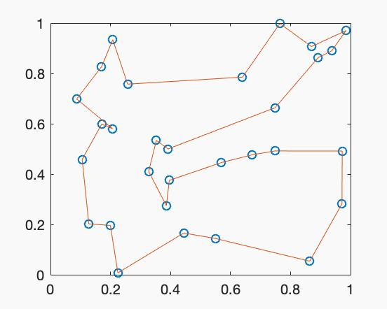
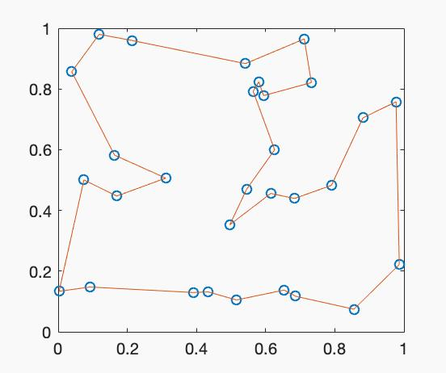

<link href="style.css" rel="stylesheet"></link>

### Simulated Annealing for Traveling Salesman Problem

***
#### How to run
- run Initialization.m first
- do not close the figure and run SimulatedAnnealing.m

***
#### Sample output

***

This is a draft of simulated annealing.  
A lot of optimizations can be implemented (actually a part of the main program is still left blank).  
I was just trying to run the program to see if there is a bug so far...  
and it works...? 

Ref: https://www.fourmilab.ch/documents/travelling/anneal/